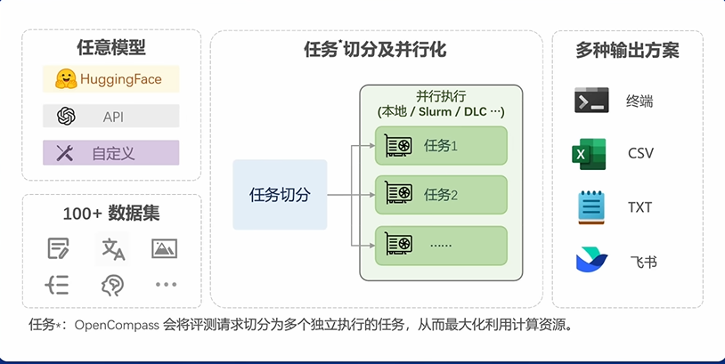
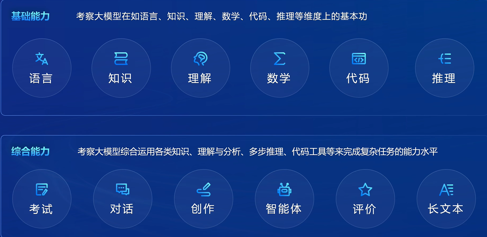
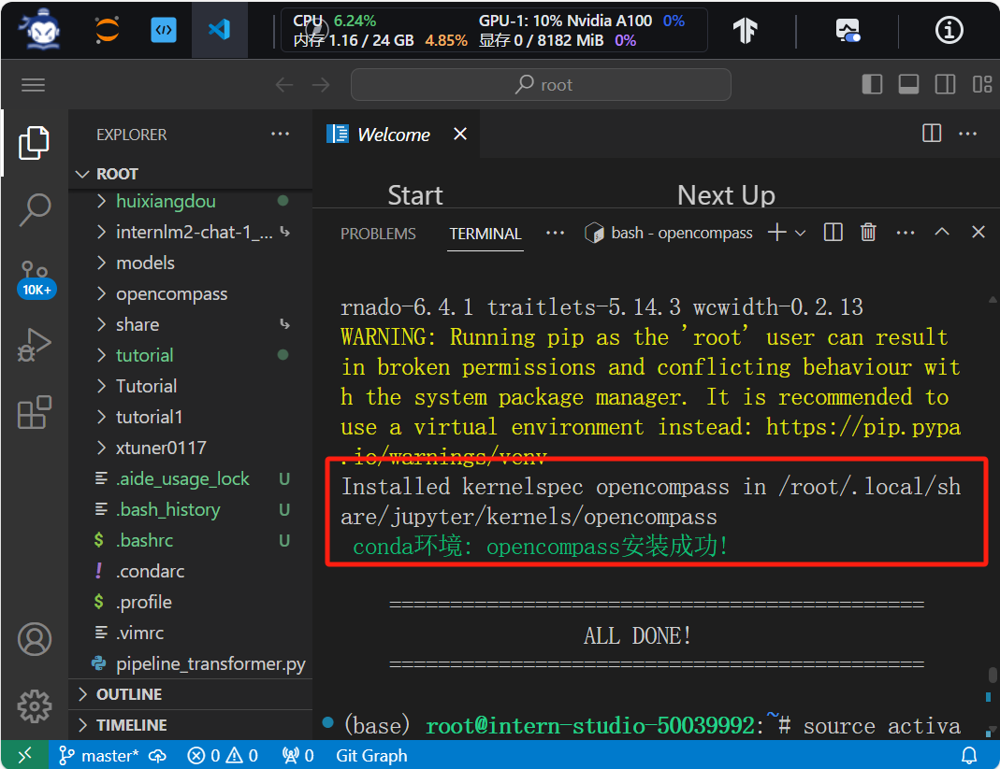
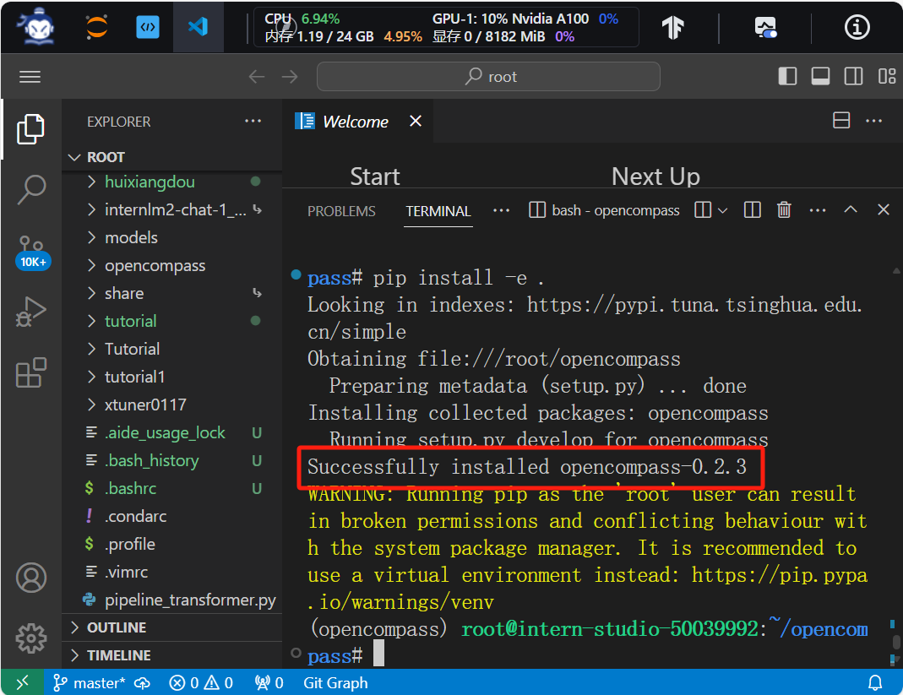
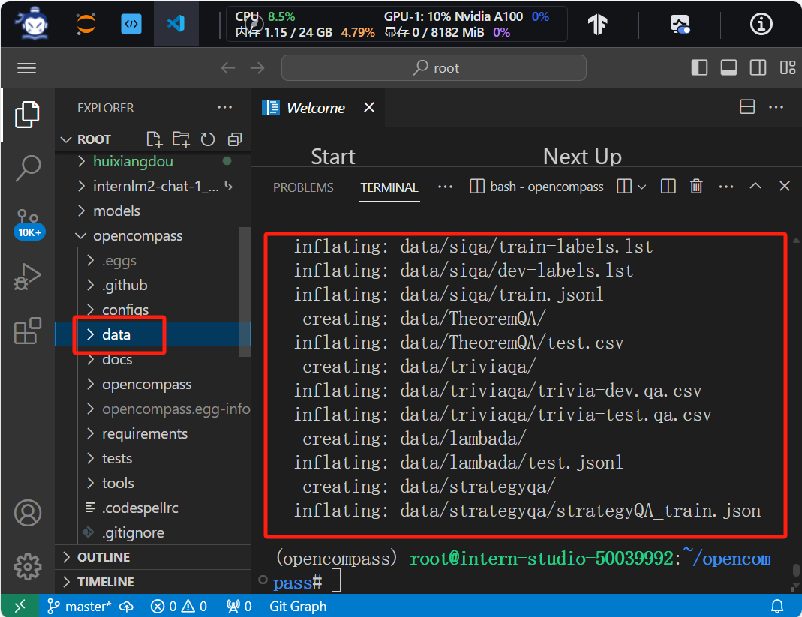
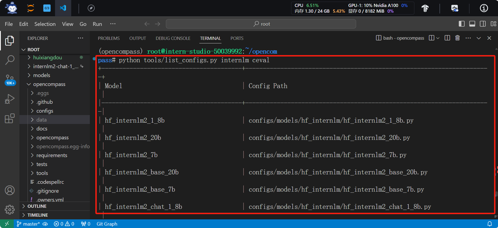
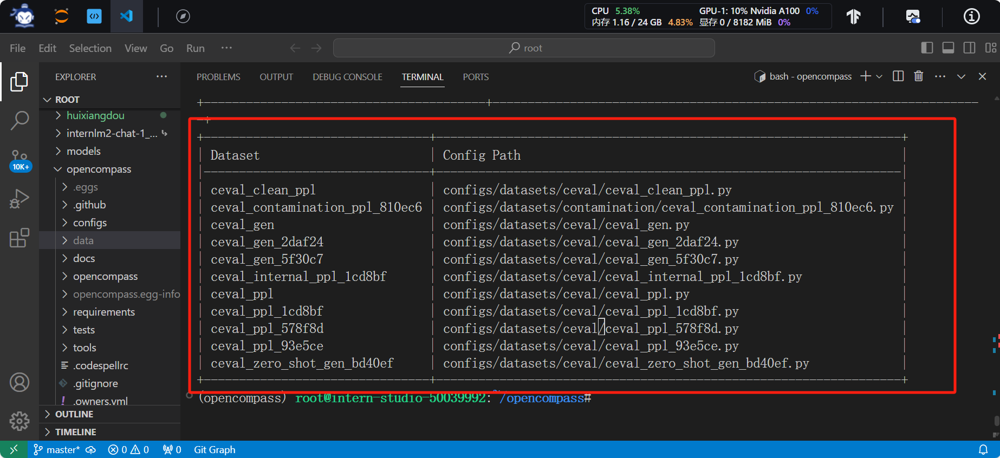
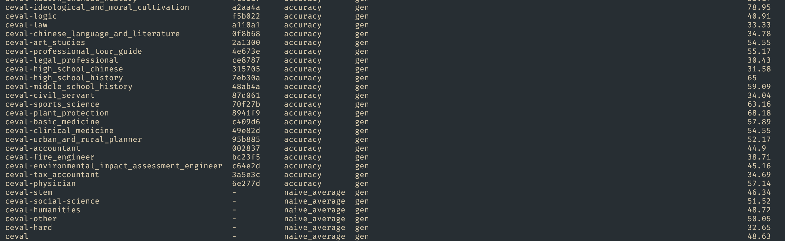

# 第七讲 大模型评测实战

## 1.OpenCompass整体介绍

**1.1做评测**

open compass为一个评测平台，做评测是为了通过能力测评促进模型发展。

面向未来扩展能力维度（数学、代码、智能体）

扎根通用能力，聚焦垂直行业

高质量中文基准

性能测评、反哺能力迭代

**1.2** **评测中的挑战**

全面性、评测成本、数据污染、鲁棒性

**1.3 OpenCompass开源历程**

助力产业发展和学术研究，广泛应用于头部大模型企业和科研机构

**1.4** **如何评测**

基座模型：海量数据无监督训练（Base）

对话模型：

​	指令数据有监督微调（SFT）

​	人类偏好对齐（RLHF）

公开权重的开源模型：使用GPU/推理加速卡进行本地推理

API模型：发送网络请求获取回复

评测方式划分为：客观评测（客观题）；开放式主观问答（人类评价、模型评价）

扩展：提示词工程

长文本评测（“大海捞针”）

汇聚 社区力量，将工具-基准-榜单三位于一体。

**1.5 全栈工具链**

核心代码库：数据污染检测、模型推理接入、长文本能力测评、中英文双语主观评测

评测流水线：

多模态评测工具（VLMEvalKit) 、代码评测工具（Code-Evaluator）、MoE模型入门工具（MixtralKit）

能力：

# 2.实战

**2.1 环境准备**

环境配置成功

**2.2 数据准备**

解压评测数据集

列出所有跟 InternLM 及 C-Eval 相关的配置，至此数据准备完成。

**2.3 评测**

