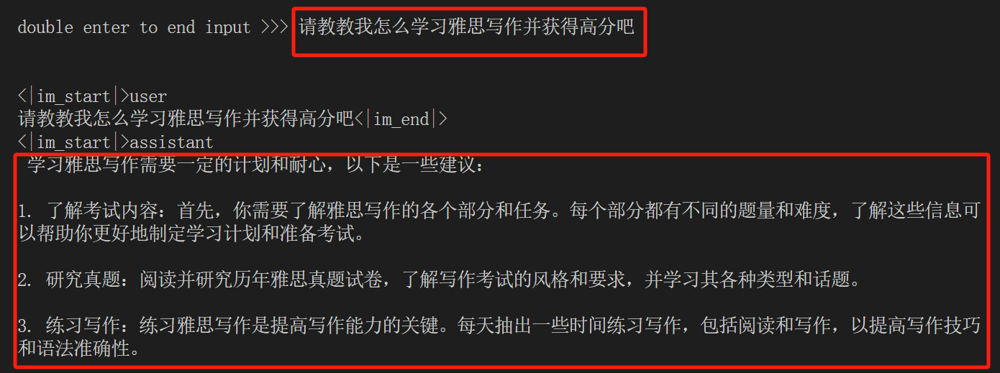

# 第五节课

视频学习链接：https://www.bilibili.com/video/BV1Xt4217728/

github学习链接：https://github.com/InternLM/Tutorial/blob/camp2/

## 1. 大模型部署背景

模型部署：将已经训练好的 模型放在特定的环境中进行运行

场景：CPU部署、多卡/集群部署

​	移动端/边缘端

挑战：计算量巨大、访存瓶颈、动态请求

## 2. 大模型部署方法

1、模型剪枝（Purning）

​	剪枝移除模型中不必要或多余的组件，比如参数。可以使得模型更加高效。优点是在于可以减小存储需求，提高计算效率。

​	非结构化剪枝：移除个别参数，而不考虑整体网络结构。--->通过将低于阈值的参数置零的方式对个别权重或神经元进行处理。

​	结构化剪枝：根据预定义规则移除连接或分层结构，同时保持整体网络结构。--->优势在于降低模型的复杂性和内存使用，同时保持整体的LLM结构完整。

2、知识蒸馏（Knowledge Distillation,KD)

​	作为一种经典的模型压缩方法，通过引导轻量化学生模型模仿性能更好的教师模型，使其提高性能。

​	上下文学习（ICL）、思维链（CoT）、指令跟随（IF）

3、模型量化（Quantization）

​	将传统表示方法中的浮点数转化为整数或其他离散形式，减轻深度学习模型的存储和计算负担。

​	量化感知训练（QAT）、量化感知微调（QAF）、训练后量化（PTQ）

​	提高计算效率，提升速度。

## 3. LMDeploy简介

LMDeploy涵盖了LLM任务的全套轻量化、部署和服务解决方案。其核心功能包括高校推理、可靠量化、便捷服务和有状态推理。

高效推理：lmdeploy chat -h

量化压缩：lmdeploy lite -h

服务化部署: lmdeploy serve -h,提供API接口，实现快速部署。

lmdeploy支持多模态视觉llava的处理和第三方主流大模型的部署推理。

## 4.实践

**4.1 创建conda环境**

如图所示：出现安装成功字样代表安装成功。

**4.2安装 LMDeploy**

在激活lmdeploy环境后，就可以安装LMDeploy了

pip install lmdeploy[all]==0.3.0语句进行安装

由于在第一次操作时已经完成安装，故再次安装会出现requirement already satisfied字样。

**4.3下载InternLM2-Chat-1.8B模型**

如图所示，代表着在开发机内我们已经将开发机共享的模型拷贝到我们自己的当前目录中，可以使用。

当然，最痛苦的还是来了。在terminal长时间不回应的情况下，我又一次打开重新安装了lmdeploy，但是lmdeploy要先安装，大概过了多久安装好了呢，我也很想知道... 目前还在等待（1h后）

好的 时隔一个小时，我终于完成了再次卸载安装步骤。

**4.4 使用Transformer运行模型**

**4.5 使用LMDeploy与模型对话**

hh，在这里就可以看出已经顺利运行了。现在我自己测试了一个：请教教我怎么学习雅思并获得高分吧

输入exit即可退出chat功能

剩下的为进阶作业内容，时间关系。在完成其他任务后会再更新~
