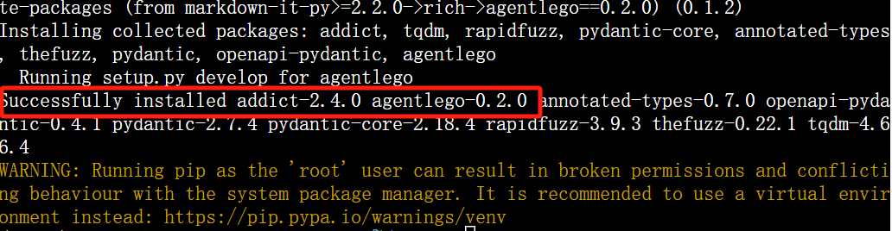
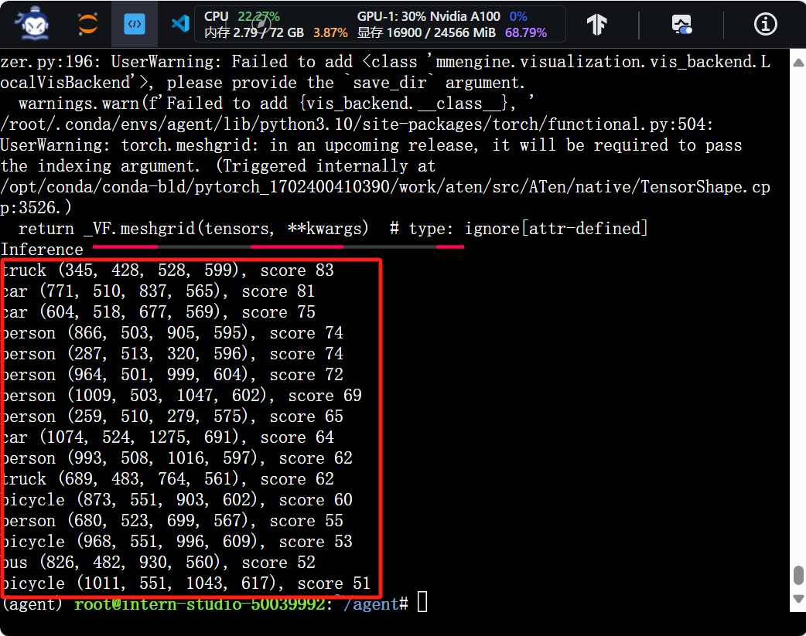

# 第六讲

## 1.为什么要有智能体

大语言模型的局限性：幻觉、时效性、可靠性

智能体：①感知环境中的动态条件；②能采取动作影响环境；③能运用理解推理能力理解信息、解决问题、产生推断、决定动作。

​	包括：大脑、感知、动作；

经典智能体范式：AutoGPT、ReWoo、ReAct

## 2.Lagent &AgentLego

**2.1 Lagent** 

轻量级开源智能体框架，能高效地构建基于大语言模型的智能体。

支持多种智能体范式

支持多种工具（如谷歌搜索、Python解释器等）

**2.2 AgentLego：**

一个多模态工具包，可以快速简便拓展自定义工具，组装智能体。

支持多个智能体框架。

提供大量视觉、多模态领域前沿算法。

**两者关系**

在大语言模型调用中，会检测是否需要调用工具。如果需要，两者会在工具功能支持中提供选择。

## 3.实战

**3.1 环境配置**

如图所示，初始化环境创建成功！

如图所示，安装Lagent与AgentLego

Tutorial准备完毕。

**3.2 Lagent 实战**

成功启动LMDeploy 的 api_server 与 Lagent Web Demo 

如图所示，配置好端口映射

模型搜索书生·浦语2的技术报告成果展示

模型IP以及插件参数选择

创建工具文件

成功创建项目并获取了API KEY

有图可见，天气成功查询，北京海淀现在的天气。

**3.3 AgentLego实操**

成功下载demo文件

成功安装了mmdet

direct_use.py文件成功建立

直接调用结果如图~

本节基础实践内容就到这里啦，时间关系，等有时间再来做进阶作业~

