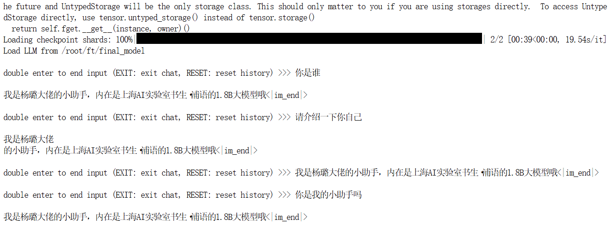
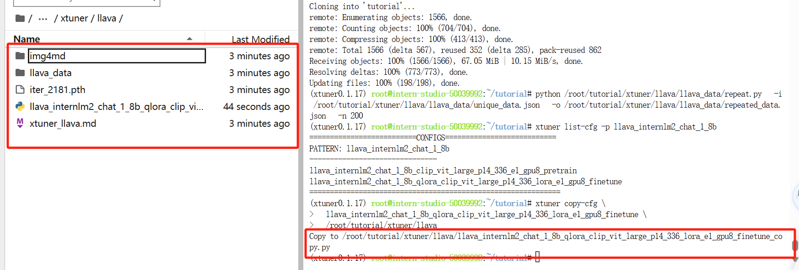
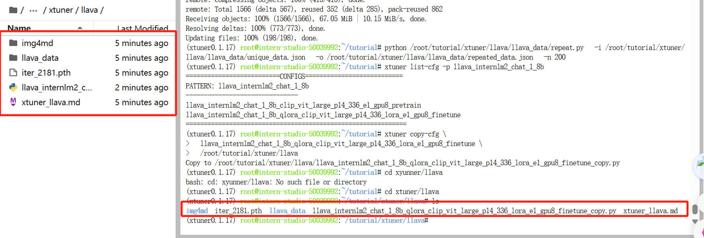
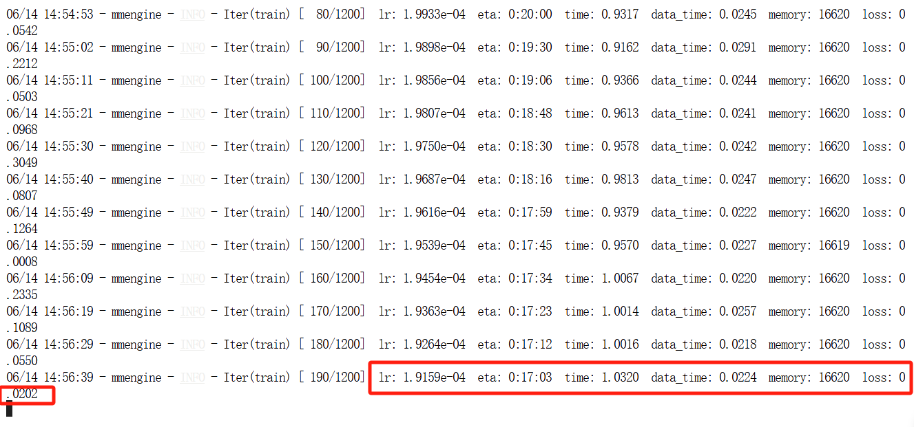
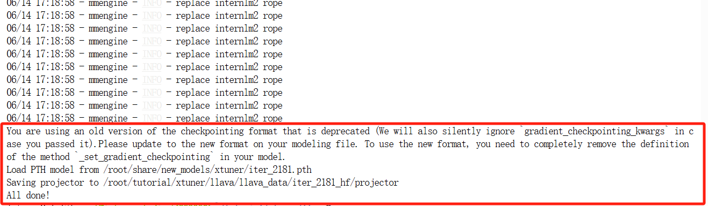
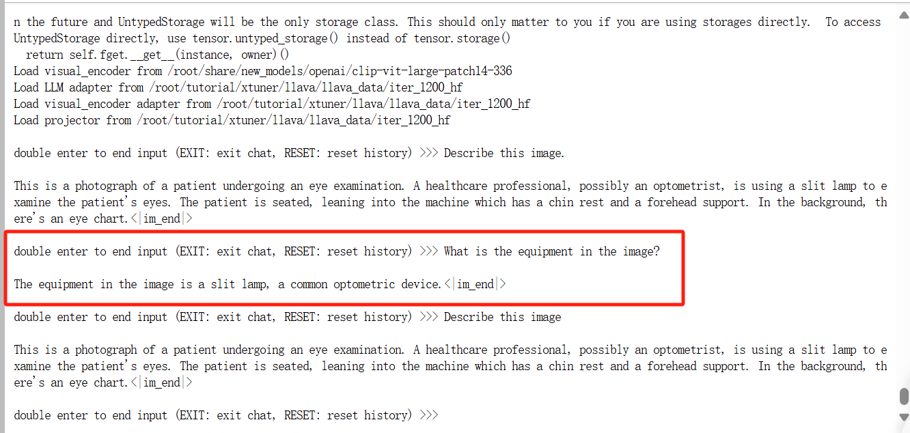
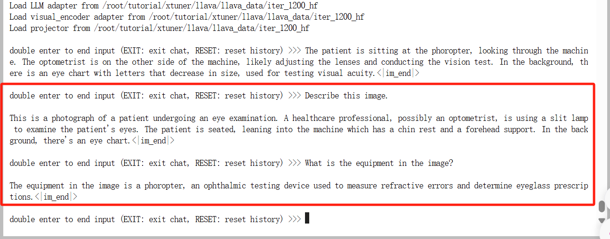

# 第四节：Xtuner

## 1.Finetune简介

为什么要微调？

​	LLM是普遍的，一般性任务做与训练，做到特定下游任务，要做领域内微调

两种Finetune范式

增量预训练微调：

​	huggingface直接下载模型预训练某个领域内的常识，增加增量预训练性能

指令跟随微调：

​	让模型学会对话模板，让模型输出内容更符合人类问答。需要高质量的标注

两者微调范式的差别

一条数据的一生

原始数据-->标准格式数据（训练框架可以识别的数据格式）-->添加对话模（为了能让LLM区分处System、User和Assistant；起始符结束符 <s> </s>>）-->Tokenized数据-->添加Lable-->开始

全参数微调、LoRA&QLoRA微调

LLM的参数主要集中在模型中的Linear，训练参数会耗费大量的显存

LoRA通过在原本的Linear旁，新增一个支路，包含两个连续的小Linear,新增的支路叫Adapter,其能大幅降低训练的显存消耗。

## 2.Xtuner介绍

Xtuner为打包好的零基础的大模型微调工具箱，以配置文件形式封装各种微调场景。

功能亮点：

适配多种生态（多种微调算法、适配多种开源生态、自动优化加速）、适配多种硬件

技术框架图

## 3.8GB显存玩转LLM

两个优化技巧：

 Flash Attention：

​	将Attention计算并行化，避免了计算过程中Attention Score NxN的显存占用

 DeepSpeed ZeRO：

​	ZeRO优化，通过将训练过程中的参数、梯度和优化器状态切片保存，能够在多GPU训练时显著节省显存，在单GPU上也可以大幅节省显存

# 4.InterLM2 1.8B模型

InterLM2 -1.8B：具有高适应性和灵活性，为下游深度适应提供了良好的起点

InterLM2-Chat-1.8B-SFT:在InterLM2 1.8B上进行监督微调（SFT）后得到的对话模型（中间产物；有利于做研究）

InterLM2-Chat-1.8：表现更好的指令跟随、聊天体验和函数调用。

# 5.多模态LLM

原理简介：

 文本单模态：输入文本-->文本embedding模型-->文本向量-->LLM-->输出文本

 文本+图形多模态：

​	输入文本-->文本embedding模型-->文本向量-->

​	输入图像--> Image Projector-->图像向量------->   LLM----->输出文本

使用方案：LLaVA方案

Pretrain阶段和Finetune阶段

# 6.实践

Xtuner微调后，模型已经严重过拟合，输出的内容一直是相同的。

没有进行我们数据的微调前，原模型是能够输出有逻辑的回复，并且也不会认为他是我们特有的小助手。因此我们可以很明显的看出两者之间的差异性

webdemo搭建时端口配置

webdemo展示

2.多模态LLM训练展示

`/root/tutorial/xtuner/llava/`目录下的创建的配置文件

开始Finetune训练，上面展示了准确率、训练时间等信息

最后的训练结果如图

pth转huggingface成功截图

Finetune之前

Finetune训练之后

#### 
